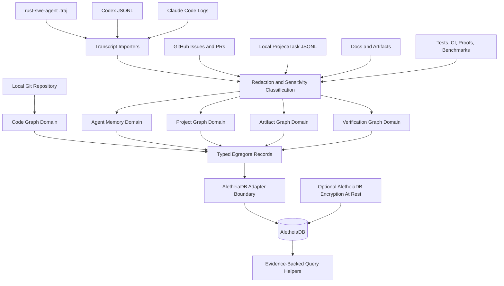

# Egregore Vision PRD

## Summary

Egregore is an AletheiaDB-backed knowledge graph substrate for agentic software engineering. It stores source-derived code facts, agent-authored memory, project and task state, artifacts, and verification evidence in one connected temporal graph so an agent can answer not only "where is this symbol?" but also "what have we learned about it, what work depends on it, what decisions shaped it, and what evidence proves the current claim?"

AletheiaDB remains the database product and storage substrate. Egregore is the agentic SWE knowledge layer that defines schemas, ingestion workflows, provenance rules, and query surfaces for software-building agents.

## Problem

Coding agents repeatedly rediscover the same project context. Code search explains where symbols live, transcripts explain what one agent saw, issue trackers explain intended work, and test logs explain what was verified, but these records usually live in separate stores with weak links between them.

That fragmentation makes agents brittle. They forget previous failed attempts, cannot distinguish source truth from agent guesses, struggle to connect an issue to the exact symbols it touched, and often cite vague "memory" instead of evidence. The product gap is not another chat transcript store. The gap is a typed, temporal graph where code, memory, work, artifacts, and verification can reference one another with provenance.

## Product Thesis

Agentic SWE needs a shared memory substrate with two kinds of truth:

- Deterministic facts, such as code structure, Git commits, file spans, test results, and artifact hashes.
- Agent-authored observations, such as hypotheses, decisions, preferences, lessons, and task summaries.

Both belong in the same graph because their relationships are the product. They must not have the same trust model. Deterministic facts should be reproducible from source or runtime evidence. Agent observations should carry author, time, confidence, source transcript, and supporting or contradicting evidence.

## Users

### Primary User: Coding Agent

The agent needs fast, evidence-backed answers about code, project history, prior attempts, decisions, and verification state across sessions.

### Primary User: Agent Operator

The operator needs inspectable local memory that can explain why an agent believes something and where that belief came from.

### Primary User: Mark

Mark needs a local-first substrate that turns repeated agent work into durable project intelligence without coupling experiments to AletheiaDB crate releases.

### Secondary User: Maintainer

The maintainer needs schema boundaries, provenance, and deterministic fixtures so memory growth does not become unreviewable sludge.

## Jobs To Be Done

- As a coding agent, I want code facts and prior agent observations connected to the same symbols, so that I can avoid rediscovering known project context.
- As an agent operator, I want every memory claim to cite source evidence, so that I can tell verified knowledge from stale guesswork.
- As a maintainer, I want project/task state connected to code and verification results, so that planning reflects real implementation risk.
- As a researcher, I want temporal queries over code, tasks, decisions, and test evidence, so that I can study how agent work evolves over time.

## Domain Model

Egregore starts with typed graph domains. Domains share one AletheiaDB store and connect through explicit edge labels.

| Domain | Owns | Examples |
|--------|------|----------|
| Code Graph | Source-derived facts | Repository, File, Symbol, Import, Call, Commit, Change, SemanticDrift |
| Agent Memory | Agent-authored observations | Session, Observation, Hypothesis, Decision, Lesson, Failure |
| Project Graph | Work management state | Product, Project, Plan, Task, GitHubIssue, LocalTask, PR, Review, AcceptanceCriterion |
| Artifact Graph | Durable generated or external artifacts | ADR, PRD, Plan, Transcript, Patch, BenchmarkReport, ReleaseNote |
| Verification Graph | Proof and runtime evidence | TestRun, CommandRun, CIStatus, BenchmarkRun, CoverageReport, ProofResult |
| User Context | Durable operator preferences and constraints | Preference, PromoteCandidate, PromotionPrompt, PromotionDecision, NamingDecision, WorkflowRule, Constraint |

## First-Class Transcript Imports

Egregore should treat agent transcripts as source artifacts, not as trusted memory by default. A transcript importer preserves the raw artifact path/hash, normalizes events into typed records, and then extracts observations only when it can attach provenance.

First-class import sources are intentionally narrow at the start:

| Priority | Source | Why First-Class |
|----------|--------|-----------------|
| 1 | `rust-swe-agent` `.traj` | Native SWE-run trajectory format with task, turns, tool calls, patch artifacts, run status, evaluation context, and verification/failure evidence. This is the best seed format for agent memory because it is already shaped around software tasks rather than generic chat. |
| 2 | Codex session / rollout JSONL | Captures the current working loop: user requests, assistant turns, tool calls, command output, file edits, interruptions, and verification claims. It should be version-tolerant and preserve raw source handles because the format can drift. |
| 3 | Claude Code transcript/log exports | Practical broad coverage for another common local agent workflow. The first importer should target the stable common denominator: turns, tool uses, command output, file edits, summaries, and timestamps when available. |

Later import sources:

- OpenHands trajectories
- SWE-agent and mini-SWE-agent trajectories beyond local `rust-swe-agent`
- Aider chat history
- Continue sessions
- Cursor/Cline/Roo Code logs
- Generic ChatML or JSONL fallback
- GitHub PR reviews/comments as project/artifact imports, not transcript imports

All first-class importers should normalize into the same event model:

| Normalized Record | Purpose |
|-------------------|---------|
| `AgentSession` | One user-visible agent session or trajectory file |
| `AgentRun` | A bounded attempt to complete a task |
| `AgentTurn` | User, assistant, tool, or system turn |
| `ToolCall` | Structured tool invocation and result handle |
| `CommandRun` | Shell command, exit status, output handle, and working directory |
| `FileEdit` | File path, diff/patch handle, and edit provenance |
| `PatchArtifact` | Patch content, validation status, and source trajectory |
| `Observation` | Agent-authored claim with confidence and provenance |
| `Decision` | Durable project or implementation decision inferred from explicit context |
| `Failure` | Failed command, invalid patch, rejected assumption, or blocked workflow |
| `Verification` | Test, lint, proof, benchmark, CI, or manual verification evidence |
| `CostUsage` | Token, wall-clock, budget, or provider-cost metadata when available |

Importers should connect normalized records to code and project graph records through edges such as `MENTIONS_SYMBOL`, `TOUCHED_FILE`, `PRODUCED_PATCH`, `VALIDATED_BY`, `FAILED_ON`, `EXPLAINS_CHANGE`, `REFERENCES_TASK`, `CONTRADICTS`, and `SUPERSEDES`.

## Trust Boundaries

Egregore must preserve trust separation even while using one graph.

- Code graph facts are source-derived and should be reproducible from a repository state.
- Verification facts are evidence-derived and should point to command output, CI result, benchmark artifact, or proof result.
- Agent memory is subjective unless linked to evidence.
- Project/task state reflects intent and workflow, not proof that code exists.
- User context reflects operator preference and must not be inferred silently from one-off or repeated behavior. Repeated evidence may create a promotion candidate, not a durable rule.
- Sensitive records require classification and redaction before persistence. Encryption at rest is defense in depth, not a substitute for redaction.

No subjective observation may overwrite or impersonate deterministic source facts. Instead, observations attach to facts through edges such as `OBSERVES`, `EXPLAINS`, `VALIDATED_BY`, `CONTRADICTS`, `SUPERSEDES`, and `RELATES_TO`.

## Preference Promotion

Egregore should make preference learning explicit. Agent observations can suggest that a durable user preference exists, but they must not silently become policy that future agents obey.

Promotion flow:

1. Record each preference-shaped claim as an `Observation` linked to the exact transcript turn, issue comment, PR review, or operator note that produced it.
2. When compatible observations repeat across sessions or corrections, emit a `PromoteCandidate` record.
3. The candidate must include proposed rule text, scope, confidence, supporting evidence, contradicting evidence, and the source that triggered promotion.
4. Log a `PromotionPrompt` action and ask the user or operator to approve, edit, reject, or defer the proposal.
5. Record the response as a `PromotionDecision`.
6. Only an explicit approval decision creates or updates a durable `Preference` or `WorkflowRule`.
7. Rejections, revocations, and supersessions remain auditable graph records and should suppress repeated prompts until materially new evidence appears.

Repeated observations are evidence for a prompt, not authorization. If Egregore cannot show the evidence and scope clearly, it is not ready to promote the rule.

## First-Class Project/Task Imports

Egregore should own project and task memory directly. The MVP import path starts with GitHub Issues and local JSONL because those cover public collaboration and local-first agent work without depending on another daemon.

First-class project/task sources:

| Priority | Source | Why First-Class |
|----------|--------|-----------------|
| 1 | GitHub Issues and PRs | Existing source of truth for repository-scoped work, review, acceptance criteria, labels, assignees, status, and links to commits or checks. |
| 2 | Local project/task JSONL | Local-first replacement path for agent task state, planning records, and operator-created work items. It should be inspectable, versioned, and importable without network access. |

Harness MCP tasks are a legacy migration source, not a first-class dependency. Egregore should replace the durable task, knowledge, and coordination surfaces Harness currently provides rather than require Harness at runtime. A later Harness importer may exist to backfill historical tasks and knowledge into Egregore, but new workflows should target Egregore records directly.

Project/task imports should normalize into shared records:

| Normalized Record | Purpose |
|-------------------|---------|
| `Product` | Long-lived product or repository initiative |
| `Project` | Bounded area of work under a product |
| `Plan` | Strategy, milestone, or implementation plan |
| `Task` | Work item with status, priority, owner, source, and temporal metadata |
| `AcceptanceCriterion` | Falsifiable requirement attached to a task, issue, PRD, or plan |
| `Review` | Review comment, finding, approval, requested change, or blocker |
| `ExternalLink` | Source-system handle such as GitHub URL, issue number, PR number, or local JSONL record ID |

The local JSONL format should be treated as the canonical offline interchange format for project/task state. GitHub import should preserve GitHub-specific handles while mapping into the same graph records so queries do not care whether a task came from GitHub or a local file.

## Redaction And Storage Protection

Egregore should assume agent transcripts, command output, issue text, local task files, and generated artifacts may contain secrets. The default posture is redact before persistence, store provenance handles, and only keep raw payloads when the operator explicitly enables a protected raw-artifact mode.

Records needing redaction before persistence:

| Record Class | Examples | Persistence Policy |
|--------------|----------|--------------------|
| Secret-bearing values | API keys, OAuth tokens, session cookies, SSH/private keys, database URLs with passwords, cloud credentials, webhook secrets | Never store raw values as queryable graph fields. Drop or replace with typed redaction markers and preserve only non-secret key names, source handles, hashes, and evidence that redaction occurred. |
| Agent transcript text | `AgentTurn`, `ToolCall` input/output, model prompts/responses, tool results, summaries | Persist redacted text plus transcript handle, turn ID, source hash, redaction policy version, and confidence. Raw transcript body is a protected artifact, not default memory. |
| Command and verification output | `CommandRun`, `TestRun`, `ProofResult`, `BenchmarkRun`, stdout/stderr, environment dumps | Persist command metadata, exit status, timing, redacted output snippets, and output artifact hashes. Environment variable values and auth-bearing headers are redacted before storage. |
| File edits and patches | `FileEdit`, `PatchArtifact`, diff hunks, rejected patches, generated files | Persist paths, spans, hashes, and redacted hunks when needed. Do not let secret-like assignments in patches become searchable raw text. |
| Project/task narrative | GitHub issue bodies/comments, PR reviews, local JSONL task descriptions, acceptance criteria, operator notes | Persist redacted narrative text and source handles. Public GitHub metadata can stay plaintext; bodies/comments still pass through the same redaction pipeline. |
| User context | `Preference`, `PromoteCandidate`, `PromotionPrompt`, `PromotionDecision`, `WorkflowRule` | Persist only approved or auditable preference text after redaction. Never store raw correction transcripts as the durable rule body. |

Structured code facts such as file paths, symbol names, imports, spans, commits, and call edges should remain plaintext by default because they are the query substrate. Raw source file contents, snippets, generated patches, and logs are not automatically safe just because they came from a repository.

AletheiaDB encryption at rest should be an optional storage protection layer. Egregore should expose a configuration and feature-gated path for AletheiaDB's `encryption` support, with `encryption-aws-kms` and `encryption-vault` treated as later operator backends. Encryption protects the local store if disk access leaks; redaction protects exports, query results, logs, memory summaries, and future migrations. We need both.

## Functional Requirements

### PR-1: Shared AletheiaDB Store

Egregore must store all domains in one AletheiaDB-backed graph so cross-domain edges can be traversed without external joins.

Acceptance criteria:

- Code graph records and at least one non-code memory domain can be ingested into the same temporary embedded AletheiaDB data directory.
- Cross-domain edges can connect an agent observation to a code symbol and a verification record.
- The system can query from a code symbol to linked observations and from an observation back to its evidence.

### PR-2: Domain Namespaces

Each domain must have explicit node kinds, edge labels, schema versions, and provenance rules.

Acceptance criteria:

- Every emitted record includes a domain or equivalent namespace.
- Code graph record IDs remain stable and deterministic.
- Agent memory record IDs include observation identity without colliding with code fact IDs.
- Schema docs identify which domains are deterministic and which are agent-authored.

### PR-3: Provenance For Agent Memory

Agent-authored memory must carry enough provenance to audit and invalidate it.

Acceptance criteria:

- Agent observations include author/agent identity, session or transcript handle, observed time, confidence, and summary.
- Observations can link to supporting or contradicting artifacts.
- Queries can filter out unverified observations.

### PR-4: Evidence-Backed Query Surface

Egregore must answer agent-useful questions with citations to graph records, not just prose.

Acceptance criteria:

- A query can answer "what do we know about this symbol?" with code location, related tasks, agent observations, and verification evidence.
- A query can answer "what changed because of this task?" by traversing task, PR or commit, symbols, and verification records.
- Returned answers include record IDs and repo-relative file/span handles where available.

### PR-5: Local-First Operation

The MVP must remain filesystem-local and inspectable.

Acceptance criteria:

- Current-tree scan, history scan, JSONL inspect, and embedded ingest work without a remote service.
- Agent memory ingestion can operate from local transcripts or explicit records.
- Remote issue trackers or hosted APIs are optional import sources, not required runtime dependencies.

### PR-6: Temporal Semantics

Egregore must preserve time as a first-class dimension across domains.

Acceptance criteria:

- Code facts preserve Git valid time and AletheiaDB transaction time.
- Agent observations preserve observation time and ingestion time.
- Project/task records preserve source update time when imported.
- Queries can ask what was believed, planned, or verified at a chosen time.

### PR-7: First-Class Transcript Imports

Egregore must import selected agent transcript formats into normalized graph records without treating raw transcript text as trusted memory.

Acceptance criteria:

- `rust-swe-agent` `.traj`, Codex session/rollout JSONL, and Claude Code transcript/log imports each have a documented source type and fixture.
- Each importer preserves the raw artifact path, content hash, source format, and importer version.
- Tool calls, command runs, file edits, patch artifacts, failures, and verification evidence become typed records.
- Extracted observations link back to the exact transcript/session/turn that produced them.
- Queries can exclude unverified observations while still retaining the raw transcript artifact for audit.

### PR-8: Explicit Preference Promotion

Egregore must support promotion from repeated observations to durable user preferences without silent inference.

Acceptance criteria:

- Repeated compatible preference observations create a `PromoteCandidate`, not a durable `Preference` or `WorkflowRule`.
- Each `PromoteCandidate` records proposed rule text, scope, confidence, supporting evidence, contradicting evidence, and source handles.
- Every user-facing promotion request is logged as a `PromotionPrompt`, and every response is logged as a `PromotionDecision`.
- Durable `Preference` and `WorkflowRule` records are created or updated only after explicit user/operator approval.
- Rejection, revocation, supersession, and edit decisions are preserved as queryable graph records.
- Agent-policy queries can require approved preferences only, while research queries can inspect observations and candidates separately.

### PR-9: First-Class Project/Task Imports

Egregore must import GitHub Issues/PRs and local project/task JSONL into one normalized project graph without depending on Harness.

Acceptance criteria:

- GitHub Issues and PRs import into `Task`, `GitHubIssue`, `PR`, `Review`, `AcceptanceCriterion`, and `ExternalLink` records where source fields are present.
- Local project/task JSONL imports into the same normalized `Product`, `Project`, `Plan`, `Task`, `AcceptanceCriterion`, `Review`, and `ExternalLink` records.
- Local JSONL import works without network access and preserves source file path, line or record ID, schema version, and imported-at time.
- GitHub import preserves repository, issue or PR number, URL, labels, state, author, assignee, milestone, timestamps, and body/comment provenance where available.
- Harness task import is documented as optional legacy migration only and is not required by any MVP project/task workflow.
- Queries can traverse from a task to linked code symbols, transcript observations, PRs, acceptance criteria, and verification evidence regardless of whether the task came from GitHub or local JSONL.

### PR-10: Redaction And Optional Storage Encryption

Egregore must classify and redact sensitive data before persistence, while allowing operators to enable AletheiaDB encryption at rest as an optional storage layer.

Acceptance criteria:

- Transcript, command-output, patch, project/task narrative, verification-output, and user-context records pass through a redaction policy before becoming persisted graph records.
- Redacted records preserve source handles, content hashes where safe, redaction policy version, and enough non-secret metadata for audit.
- Secret-bearing values are not stored as queryable plaintext fields, even when encryption at rest is enabled.
- Raw transcript or artifact bodies are stored by handle/hash by default; storing protected raw payloads requires an explicit operator configuration.
- Egregore exposes an optional path to enable AletheiaDB `encryption` for embedded stores, with AWS KMS and Vault backends treated as optional later operator integrations.
- Query/export surfaces can distinguish redacted fields from absent fields and do not silently rehydrate raw secrets.

## Non-Goals

- No hosted SaaS requirement in the MVP.
- No remote repository crawling as a default workflow.
- No claim that agent memory is truth without evidence.
- No replacement for AletheiaDB. Egregore is the agentic SWE schema and workflow layer on top of it.
- No broad project-management clone before the code graph and agent memory join are proven.
- No automatic code modification in the memory substrate itself.
- No generic transcript soup as the MVP. Generic ChatML/JSONL import is a later fallback after the first-class SWE-shaped formats prove the normalized event model.
- No treating encryption at rest as permission to persist raw secrets in normal graph records.

## Competitive Frame

Egregore overlaps several categories but does not fit cleanly into one.

- Code intelligence tools such as Sourcegraph, OpenGrok, Zoekt, rust-analyzer, CodeQL, Semgrep, LSIF, SCIP, and Glean help find code structure or patterns, but usually do not store agent memory and project decisions in the same local temporal graph.
- Agent systems such as OpenHands, Codex-style trajectories, Continue, and SWE-agent keep trajectories or working context, but often treat code search, memory, issue state, and verification evidence as separate retrieval surfaces.
- Project tools such as GitHub Issues, Jira, Linear, and GitHub Projects track intent and status, but they do not natively connect tasks to exact code facts, agent observations, and local verification artifacts.
- GraphRAG and knowledge graph systems connect concepts, but they need SWE-specific schemas, provenance rules, and deterministic source-derived facts to avoid turning code intelligence into vibes with edges.

Egregore wins if it makes the relationship graph itself useful: code facts, work intent, memory, and evidence should be traversable together while keeping their trust levels explicit.

## Architecture

## Roadmap

### M1: Code Graph Domain

Implemented and maintained as `docs/prd/0001-codebase-knowledge-graph.md`.

### M2: `rust-swe-agent` Trajectory Import

Import `.traj` files as the first agent-memory source. Preserve raw trajectory artifacts, normalize SWE-run events, and connect patch, failure, command, and verification evidence to code graph records where stable handles exist.

Exit criteria:

- A fixture `.traj` imports into `AgentSession`, `AgentRun`, `AgentTurn`, `ToolCall`, `CommandRun`, `PatchArtifact`, `Failure`, and `Verification` records.
- The importer preserves source path/hash and importer version.
- An invalid or unverified patch remains labeled invalid/unverified instead of becoming a false success memory.

### M3: Codex Session Import

Import Codex session or rollout JSONL into the same normalized event model. This is the current local workflow source, so it should preserve interruptions, tool outputs, verification claims, and file-edit provenance.

Exit criteria:

- A local Codex JSONL fixture imports without losing user/assistant/tool turn ordering.
- Tool calls and command outputs have stable artifact handles.
- Verification claims can be compared with actual command results when present.

### M4: Claude Code Transcript Import

Import Claude Code transcript/log exports using a tolerant adapter over the stable common denominator: turns, tool uses, command output, file edits, summaries, and timestamps.

Exit criteria:

- A Claude Code fixture imports into the normalized event model.
- Missing optional fields degrade to explicit unknown metadata rather than guessed values.
- Raw transcript artifacts remain available for audit.

### M5: Agent Memory Domain

Add local ingestion for agent observations with provenance, confidence, transcript handles, and support/contradiction edges.

### M6: Redaction And Optional Encryption

Add the shared redaction/classification pipeline before transcript, command, patch, verification, project/task, and user-context records are persisted. Expose optional AletheiaDB encryption-at-rest configuration after plaintext redaction is enforced.

Exit criteria:

- A fixture containing tokens, cookies, database URLs, and `.env`-style assignments imports without storing secret values as queryable plaintext.
- Redacted records preserve source handles, safe hashes, redaction markers, and policy version.
- Optional AletheiaDB encryption can be enabled for an embedded store without changing query semantics.

### M7: Explicit Preference Promotion

Promote repeated preference-shaped observations through an auditable approval flow instead of silently creating durable rules.

Exit criteria:

- Repeated compatible observations can produce a `PromoteCandidate` with source evidence and scope.
- The approval UI or CLI logs `PromotionPrompt` and `PromotionDecision` records.
- Approval is required before a `Preference` or `WorkflowRule` becomes available to agent-policy queries.
- Rejected candidates do not keep prompting unless materially new evidence changes the proposal.

### M8: Cross-Domain Evidence Links

Connect observations to code symbols, commits, tasks, artifacts, and command/test evidence.

### M9: Project/Task Domain

Represent products, projects, plans, tasks, GitHub issues, PRs, local JSONL work items, reviews, and acceptance criteria as graph records that can connect to code and evidence.

Exit criteria:

- A GitHub Issue/PR fixture imports into normalized project graph records with source handles preserved.
- A local JSONL fixture imports into the same normalized project graph without network access.
- A query can traverse from one imported task to linked transcript observations, code facts, acceptance criteria, and verification records.
- Harness migration remains optional and no MVP workflow requires a running Harness daemon.

### M10: Query Workflows

Ship graph-only query helpers for:

- "What do we know about this symbol?"
- "What work touched this subsystem?"
- "Which prior attempts failed here?"
- "What evidence supports this memory?"
- "What changed between these commits, and why?"

## Success Metrics

- A temporary embedded AletheiaDB store can contain code graph records, one agent observation, one task, one artifact, and one verification record connected by cross-domain edges.
- A `rust-swe-agent` `.traj` fixture imports into normalized agent-memory records while preserving raw artifact provenance.
- Codex and Claude Code transcript fixtures import into the same normalized event model without losing turn order or tool-call provenance.
- Querying a symbol returns code location plus linked memory and verification evidence with record IDs and file/span handles.
- Unverified agent observations can be excluded from query results.
- Repeated compatible preference observations create a `PromoteCandidate` with evidence links, and no durable `Preference` or `WorkflowRule` exists until explicit approval.
- GitHub Issue/PR and local project/task JSONL fixtures import into the same project graph records, and no MVP project/task workflow requires Harness.
- Secret-bearing transcript, command, patch, verification, task, and user-context fixture values are redacted before persistence, while optional AletheiaDB encryption can be enabled without changing query semantics.
- Re-ingesting deterministic code facts is byte-for-byte stable at the JSONL layer for an unchanged repository.
- A user can inspect the graph and distinguish source facts from agent-authored memory without reading implementation code.

## Open Product Questions

- Should any commands prefer the short `eg` alias in examples, or should docs keep `egregore` as the explicit primary form?
- What exact Claude Code export/log shape should be the first fixture?
- Which Codex JSONL fields are stable enough to rely on, and which must be treated as optional drift-prone metadata?
- What UI or CLI surface should present `PromoteCandidate` approvals first?
- What default evidence threshold should create a `PromoteCandidate` without being noisy?
- Which AletheiaDB encryption backend should be exposed first beyond the base local encryption path: AWS KMS, Vault, or both?
